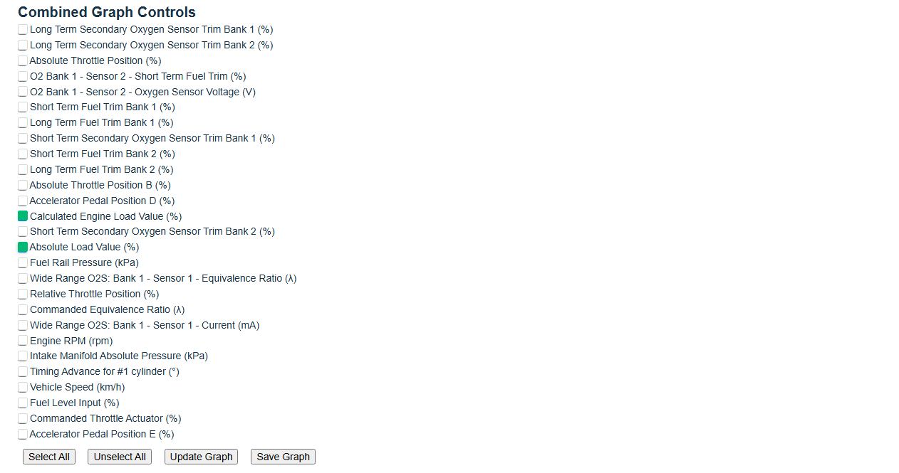
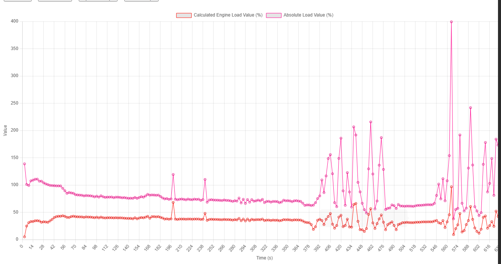
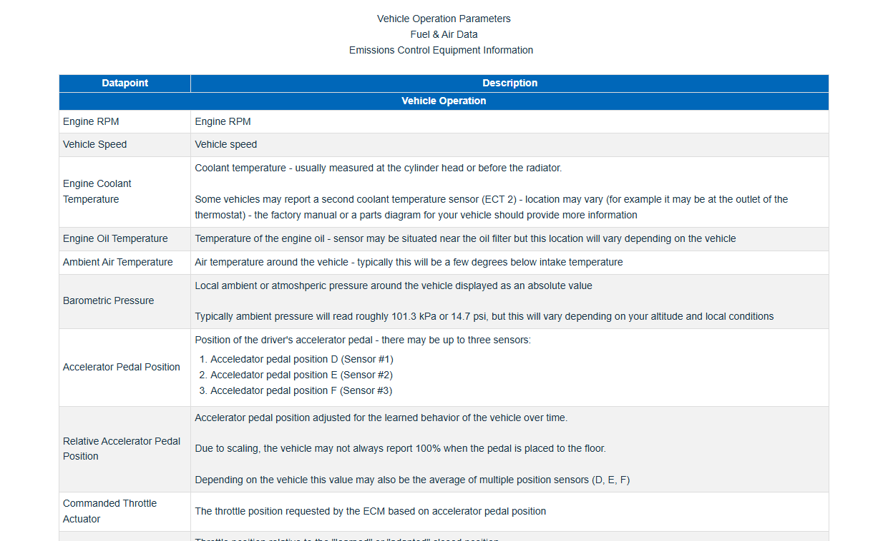

# My Blue Driver OBD2 Scanner Live Data Plotter

I use this to plot my live data

## How ?

it uses HTML and JavaScript, just load the HTML file in your browser, then load you file. (see test file in the [test directory](test/example.csv))

## Tips

1) Remove the last few seconds if you were recording while the car was off, it will mess up the scaling

## Screen Shots

## Live Data Definitions

Take From [BlueDriver Support Site](https://support.bluedriver.com/support/solutions/articles/43000551789-live-data-guide)

### 🔍 Understanding the Two "Load" Percentages:

####  **Calculated Engine Load Value (%)**

* Defined by SAE J1979 (PID 04)
* Formula:

  $$
  \text{Load} = \frac{\text{Air Mass}}{\text{Max Theoretical Air Mass at that RPM}} \times 100
  $$
* Reflects **driver demand, intake restriction, turbo boost**, and RPM
* BMWs often idle at 30–40% (normal)

####  **Absolute Load Value (%)**

* Defined by SAE J1979 (PID 43)
* Formula:

  $$
  \text{Load} = \frac{\text{Current Air Mass}}{\text{Air Mass at WOT at current RPM}} \times 100
  $$
* **Ignores driver input and throttle position**
* Often **higher at idle**, especially in turbo engines

---

###  Why Absolute Load Is > 70% at Idle:

* Turbocharged engines can reach WOT airflow **very easily** due to low compression ratio and low manifold pressure at idle
* Thus, **"idle airflow" / "max WOT airflow at same RPM"** results in **high percentages**
* This is expected — not a fault

---

###  Why They Both Increase With Electrical Load:

* Additional alternator drag and torque demand increase:

  * Airflow
  * Injector pulse width
  * Throttle opening
* Both PIDs react accordingly, which is **a sign of good ECU behavior**

---

###  Summary:

| Load Type           | % at Idle | % at Load                       | Affected by Throttle? | Affected by Electrical Load? |
| ------------------- | --------- | ------------------------------- | --------------------- | ---------------------------- |
| **Calculated Load** | 30–34%    | Up to \~90%                     | ✅ Yes                 | ✅ Yes                        |
| **Absolute Load**   | 70–74%    | Up to \~400% (buggy or clipped) | ❌ Not directly        | ✅ Yes                        |

